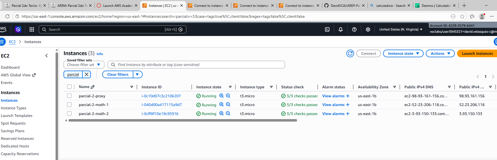
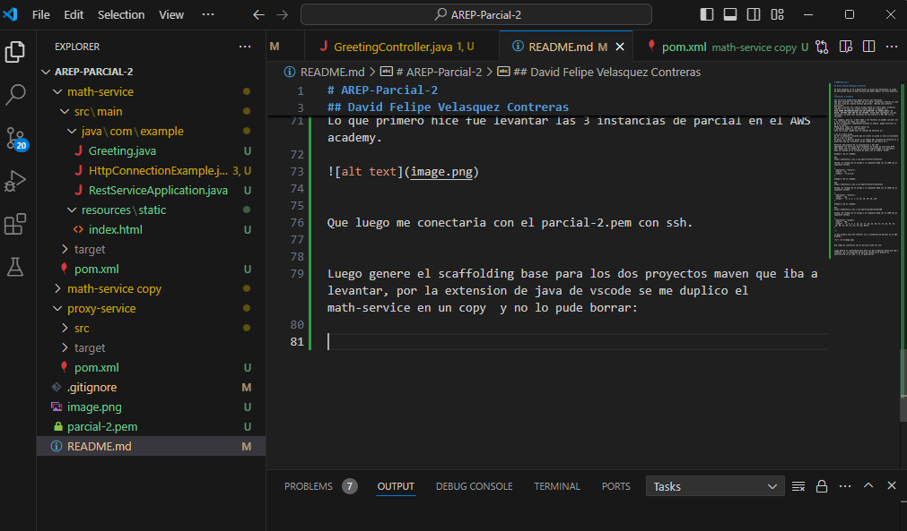
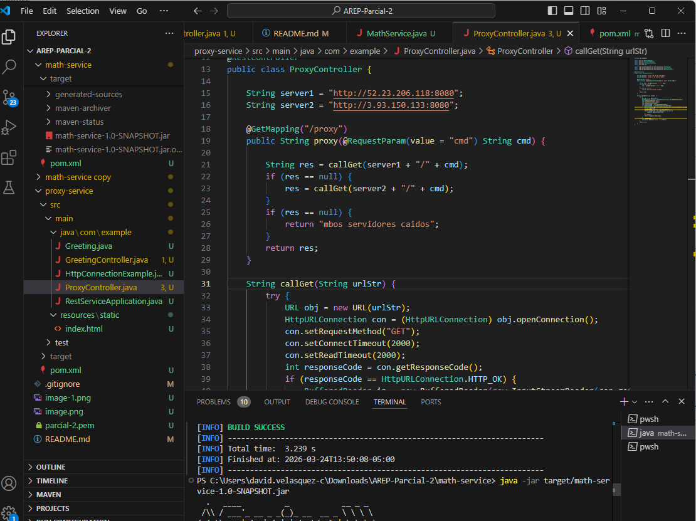
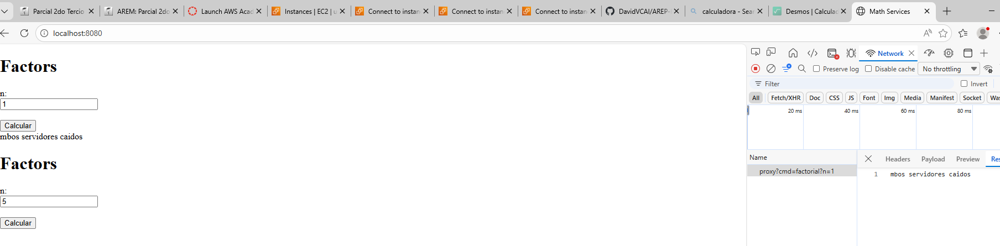
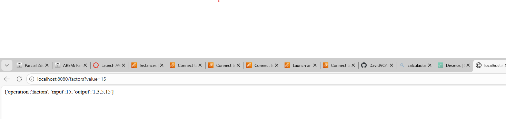
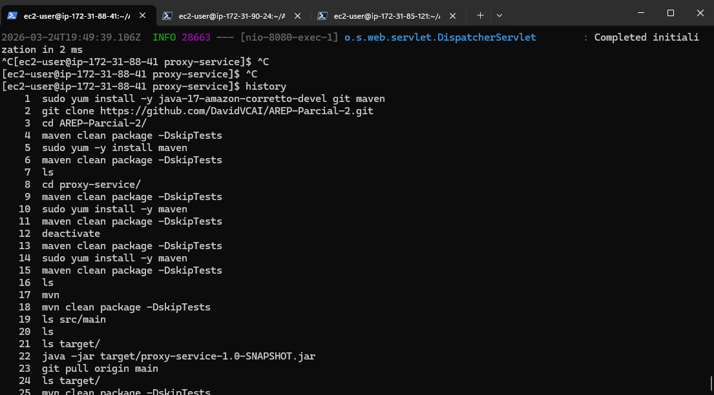
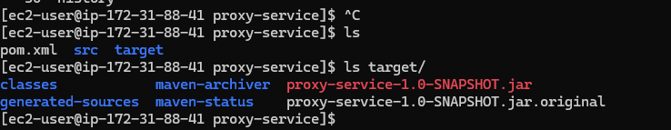
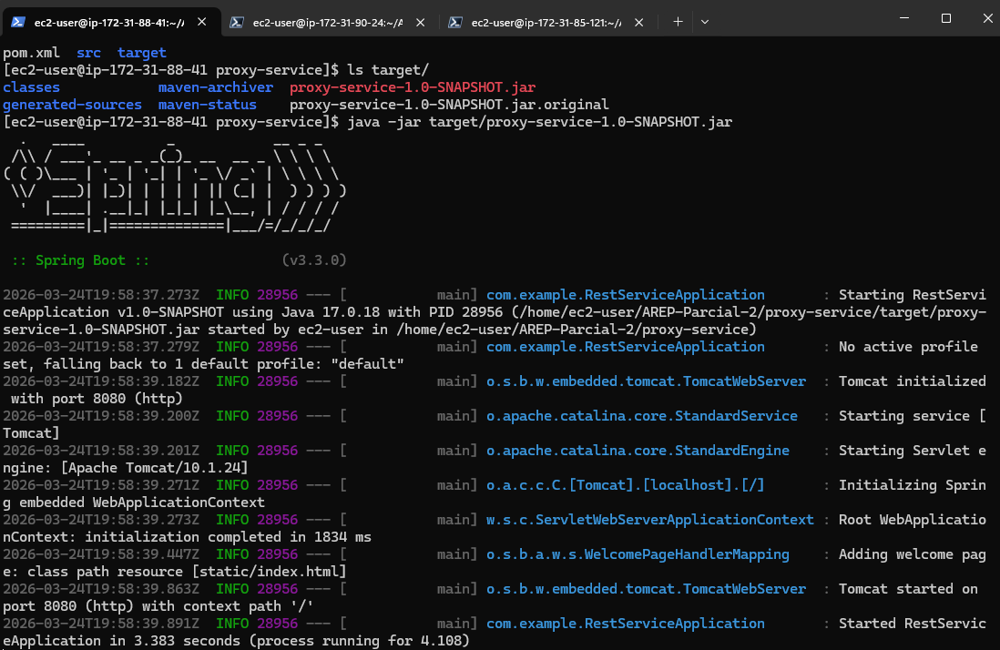
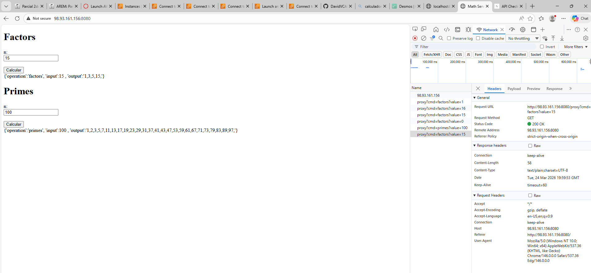
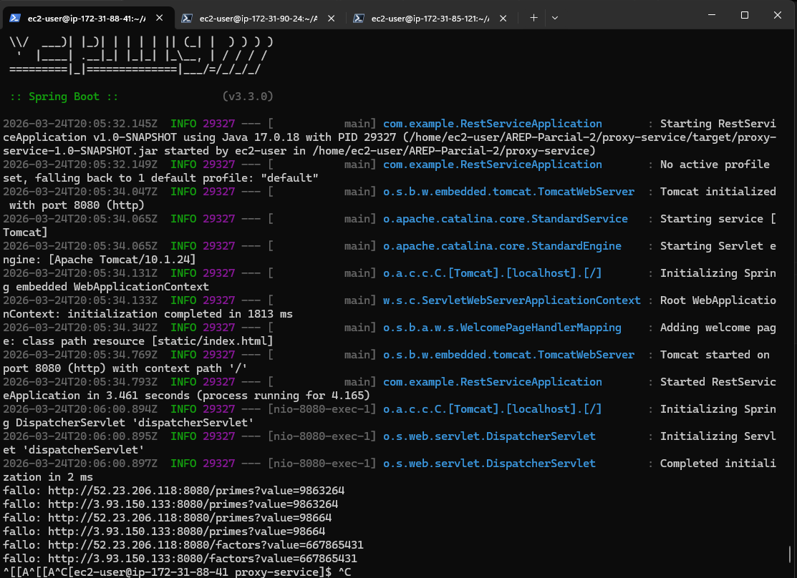

# AREP-Parcial-2

## David Felipe Velasquez Contreras

En este proyecto se va a desarrollar un proxy que balanceara la carga de peticiones hacia un math service que debe cumplir con este objetivo:

**Link del video funcionando:** https://drive.google.com/file/d/17vVttw-FIJM4LUrkcKSvHiruTa35PL1L/view

---
**Factores y Primos**

Sus servicios matemáticos deben incluir dos funciones. 
Una para calcular los factores de un número: factors(n) retorna un json con una lista de números enteros positivos. (Recibe solo enteros positivos)
Una para calcular los números primos hasta un número dado: primes(n), retorna en un json los números primos menores o iguales a n.
PARA AMBAS IMPLEMENTACIONES USE UN ALGORITMO  DE FUERZA BRUTA, ES DECIR, EXPLORE CADA UNO DE LOS VALORES. Usted debe implemntar las dos funciones, no debe usar funciones de una librería o del API (si ya existen).
 
Por ejemplo, para un  número dado n los factores se pueden calcular así:
1 es un factor de todos los números
De ahí en adelante, simplemente mirando el módulo, puede verificar si es o no factor.
Puede mirar todos los numeros hasta n/2
n pertenece también a los factores.
Para los primos, puede usar su función de factores así:

1 es un número primo
de ahí en adelante recuerde que un número es primo si solo es divisible por 1 y por si mismo.
Es decir, un número es primo si el tamaño del conjunto de factores es 2.
Asegúrese que sus funciones sirven cuando el parámetro es 1.
 
Detalles adicionales de la arquitectura y del API
Implemente los servicios para responder al método de solicitud HTTP GET. Deben usar el nombre de la función especificado y el parámetro debe ser pasado en la variable de query con el nombre "value".
 
Ejemplo 1 de un llamado:
 
EC2
https://amazonxxx.x.xxx.x.xxx:{port}/factors?value=13
 
Salida. El formato de la salida y la respuesta debe ser un JSON con el siguiente formato
 
{
 "operation": "factors",
 "input":  15,
 "output":  "1,3,5,15"
}
 
Ejemplo 2 de un llamado:
 
EC2
https://amazonxxx.x.xxx.x.xxx:{port}/factors?value=112
 
Salida. El formato de la salida y la respuesta debe ser un JSON con el siguiente formato
 
{
 "operation": "factors",
 "input":  112,
 "output":  "1, 2, 4, 7, 8, 14, 16, 28, 56, 112"
}
 
Ejemplo 3 de un llamado:
 
EC2
https://amazonxxx.x.xxx.x.xxx:{port}/primes?value=100
 
Salida. El formato de la salida y la respuesta debe ser un JSON con el siguiente formato
 
{
 "operation": "primes",
 "input":  100,
 "output":  "2, 3, 5, 7, 11, 13, 17, 19, 23, 29, 31, 37, 41, 43, 47, 53, 59, 61, 67, 71, 73, 79, 83, 89,97"
}

---

Lo que primero hice fue levantar las 3 instancias de parcial en el AWS academy. 

Que luego me conectaria con el parcial-2.pem con ssh. 

Luego genere el scaffolding base para los dos proyectos maven que iba a levantar, por la extension de java de vscode se me duplico el math-service en un copy  y no lo pude borrar:

Configuro luego la parte del proxy controller que es lo que va a hacer la logica de balanceo de carga si alguna de las respuestas es nula.

Hice el front sencillo para recibir el valor y enviarlo y hacer la peticion, ya que habia puesto las dos ip publicas de las instancia en el proxy decia que ambos estaban caidos:

Pero al cambiar:

Luego lo que hice fue hacer ssh a las 3 instancias y ejecutar los comandos basicos: 

Entonces instalo los paquetes, luego hago pull al repo ya con el commit hecho, compilo con maven y lo levanto con java -jar y el jar creado en la carpeta target

Luego de esto queda levantado el servidor para probar desde la ip publica de la instancia:

En las otras dos instancias hago lo mismo pero dentro de la carpeta math-service no proxy-service. 

Y luego de unos arreglos ya quedaria funcionando el programa:

Restan algunas cosas esteticas pero quedaria funcionando.

Los dos servidores a los que se les pega son:

    String server1 = "http://52.23.206.118:8080";
    String server2 = "http://3.93.150.133:8080";

Y el servidor base es:

    http://98.93.161.156:8080/

El server falla cuando las peticiones son de numeros muy grandes.

